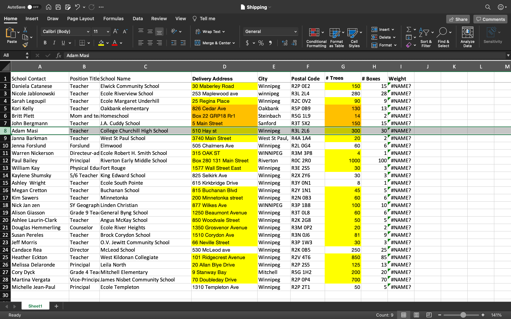
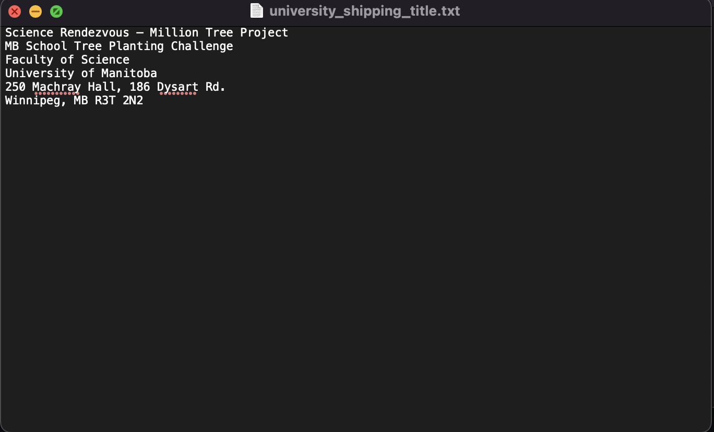
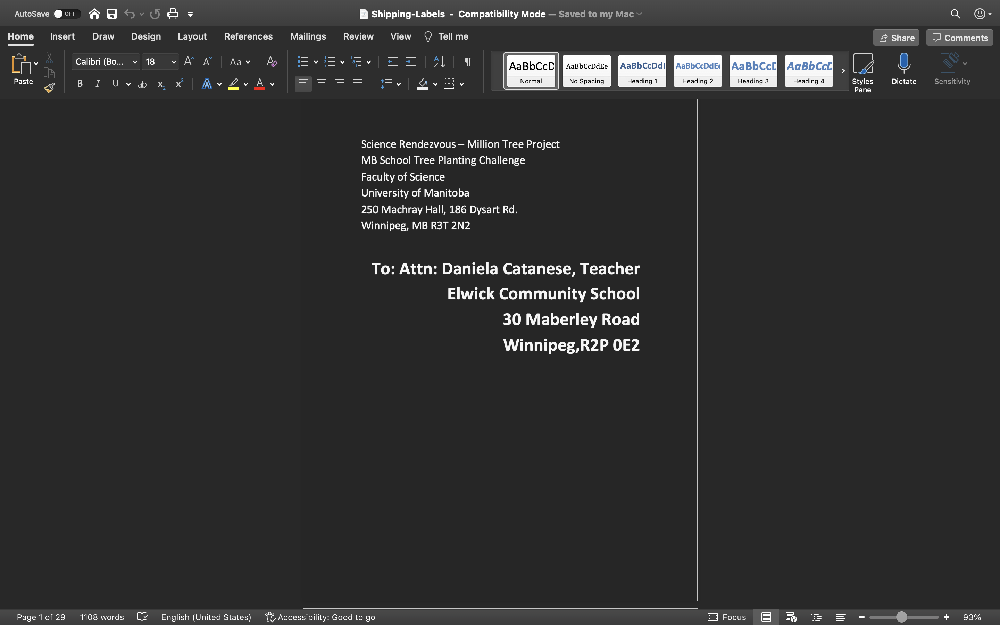

# Shipping Label Creator

### Purpose :

This script was created to automate the task for making shipping labels for Science Rendevouz(2021).

### How to use :

To use scrip you will need a Shipping.xslx file, a university_shipping_title.txt.
The all the required packages are mentioned in the requirments folder.

### Install Pre-requisites

```bash
pip3 install -r requirements.txt
```

##### Shipping.xslx :

It is the file with all of the data that includes

- School Contact : Person of Contact for the school
- Position Title : Position of the person at the school
- School Name : Name of the school
- Delivery Address : Delivery address of the school
- City : Name of the City
- Postal Code : Postal Code of the school
- \# Trees : Number of the tree requested by the school
- \# Boxes, Weight : Weight of the expected delivery box



##### university_shipping_title.txt :

It is the file which includes the senders message for each shipping label.



### Running the script:

==Note: The names of the files are hardcoded in the script, change those if you are using different filenames==

```bash
python3 create-labels.py
```

### Result :

It creates shipping label as per the requested format by the UofM department.

Result Image :

